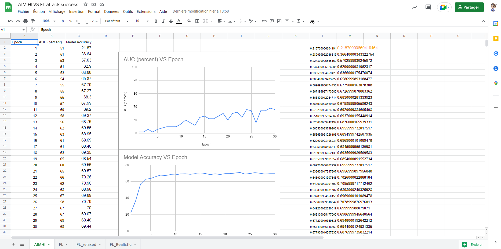

# AIM-HI report

- [AIM-HI report](#aim-hi-report)
  - [Model chosen](#model-chosen)
  - [Voting and Consensus function](#voting-and-consensus-function)
  - [Model training loop](#model-training-loop)
    - [Train local function](#train-local-function)
  - [Settings](#settings)
  - [Results obtained:](#results-obtained)


## Model chosen

```py
def create_model():

    
    # CIFAR10 model
    model = models.Sequential()
    model.add(layers.Conv2D(32, (3, 3), activation='relu', input_shape=(32, 32, 3)))
    model.add(layers.MaxPooling2D((2, 2)))
    model.add(layers.Conv2D(64, (3, 3), activation='relu'))
    model.add(layers.MaxPooling2D((2, 2)))
    model.add(layers.Conv2D(64, (3, 3), activation='relu'))
    model.add(layers.Flatten())
    model.add(layers.Dense(64, activation='relu'))
    model.add(layers.Dense(10))

    model.compile(optimizer='adam',
              loss=tf.keras.losses.SparseCategoricalCrossentropy(from_logits=True),
              metrics=['accuracy'],
              #run_eagerly=True #debug only
              )

    return model
```

The model chosen is the same as the FL model. Everything used default settings when necessary.
Optimizer is `adam` and loss is calculated using Sparse Categorical Crossentropy.

## Voting and Consensus function

The voting and consensus function used for the experiment is unanimous voting. That is unless all participants agree on the label, the image won't be part of the training set for the current iteration.

```python
def new_vote(voters, images, labels, test_image, test_labels):

    #print(images[0])

    f = open(filename, "a")

    global_predictions = []
    for i, v in enumerate(voters):
        global_predictions.append(v.predict(images))
        #check_learner_acc(v, images, labels)
        results = v.evaluate(test_image, test_labels, batch_size=128, verbose=0)
        print(f"results of voter {i} acc test: loss={results[0]} acc={results[1]}")
        #print(len(images), len(labels))
        print(f"{e},{i},{results[0]},{results[1]}", file = f)

    global_predictions = np.array(global_predictions)
    f.close()

    #print(global_predictions)

    # Voting part loop
    image_voted     =       []
    label_voted     =       []
    image_not       =       []
    label_not       =       []

    certain_global = []
    count = 0

    for i in range(len(labels)): 
        tmp = np.zeros(10)

        for cg in global_predictions:
            best = np.argmax(cg[i])
            tmp[best] += 1 #select only the best and check that its equal to 5 ie unanimous vote        
     
        if tmp[np.argmax(tmp)] == len(voters):
            image_voted.append(images[i])
            label_voted.append(labels[i])

            if np.argmax(tmp) == labels[i]:
                count += 1
        else:
            image_not.append(images[i])
            label_not.append(labels[i])
    
#    check_vote(global_predictions, certain_global, label_voted)

    return [image_voted, label_voted], [image_not, label_not], count
```

A file is created and each time this function is called, the loss and accuracy of each model is recorded on that file with the following format:

```csv
Epoch,Learner,Loss,Accuracy
0,0,1.7411577365875244,0.3758000135421753

---SNIP---

1,4,1.7231868793487548,0.3840000033378601
2,0,1.4522437152862548,0.49869999289512634
```

## Model training loop

```python
# Training loop iterations
while len(global_x) != 0 and e<epochs:
    print(f"Training epoch {e}")

    e += 1

    voted, remaining, count = new_vote(learners,
                                global_x, 
                                global_y,
                                x_test, y_test)
    
    global_x = np.array(remaining[0])
    global_y = np.array(remaining[1])

    # fit model to the new labels
    # Training loop
    for j in range(len(learners)):
        print(f"Training learner {j}")

        tmp_img = trainsets[j][0]
        tmp_labels = trainsets[j][1]

        #print(tmp_labels)
        #print(certain_global)

        trainsets[j][0] = np.append(tmp_img, 
                                    voted[0],
                                    axis=0)
        trainsets[j][1] = np.append(tmp_labels, voted[1], axis=0)
        
        #assert len(trainsets[j][0]) == len(trainsets[j][1])

        train_local(trainsets[j][0], trainsets[j][1], [], j, e) #old code
        #train_local(voted[0], voted[1], learners, j)
        learners[j] = load_model(f'models/new_method/model_{j}.tf')
```

The server has all the unlabeled data and sends all of it to the participants. Using unanimous voting, each particiapnt only trains on the images that were labeled and the rest is kept for the next iteration. We continued this loop until there was no data left to be trained on or after a certain number of epochs, which ever came first.

### Train local function

```python
def train_local(train_x, train_y, learners, i, epoch_num):

    model = create_model()

    model.fit(train_x, train_y, epochs=10, shuffle=True, verbose=0)

    # Maybe better way but needed to save into a file at one point
    model.save(f'models/new_method/model_{i}.tf')
    if i == 0:
        model.save(f'models/epochs/model_{epoch_num}_{i}.tf')
```

One problem with TF that happened was that a pre-trained model, the accuracy on the test set would start going down. The fix to this semmed to create an entirely new model and train it again. Each model trains on the dataset it owns and the one that was classified for 10 epochs before the next communication round. 

## Settings

The settings can be modified before the voting loop under the `Global Vars` header.

```python
##############
# Global Vars
##############

"""
0 = all messages are logged (default behavior)
1 = INFO messages are not printed
2 = INFO and WARNING messages are not printed
3 = INFO, WARNING, and ERROR messages are not printed
"""
#os.environ['TF_CPP_MIN_LOG_LEVEL'] = '2' 

# Use GPUs
tf.config.set_soft_device_placement(True)
#tf.config.run_functions_eagerly(True) # debug for model not compiling
#tf.debugging.set_log_device_placement(True) #uncomment if need to check that it is executing off of GPU
tf.get_logger().setLevel('ERROR')

filename = "outputs/plotdata_new_algo_1K_local.csv"

f = open(filename, "a")
f.write("Epoch,Learner,Loss,Accuracy\n")
f.close()

(x_train, y_train), (x_test, y_test)= keras.datasets.cifar10.load_data()

x_train = x_train/255.0
x_test = x_test/255.0

train_size = 40000

assert train_size < len(x_train)

trainsets, global_x, global_y, local_ds  = dataset_formatting(x_train, y_train, train_size, 10, 5)
#trainsets, global_x, global_y = dataset_formatting_label_culling(x_train, y_train, 20000, True, 0.0)

# Set number of itterations either via local_ds or number of epochs to train
epochs = 30
```

`train_size` is the size of the unlabeled datasets that each participant will have to label and then train on.

**Summary:**

```
- 5 clients 
- 40K unlabeled 
- adam (default settings)
- batch_size = 128
- commrounds = 600
- comm period =  evaluation period = 20
```

## Results obtained:

The results obtained for the first model (`model_0.tf`) are compiled in the google spreadsheet under the AIM-HI Tab:

