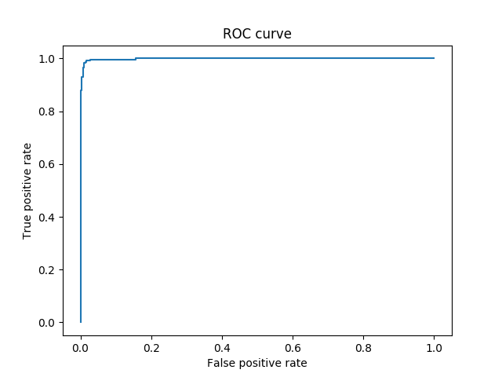

# Membership Inference Attacks on Seq2Seq Models

This tutorial demonstrates the **average rank thresholding** membership inference attack on a machine translation model.

## Background

### Dataset

The Speaker Annotated TED (SATED) dataset was used for training the machine translation model. 
This dataset consists of language pairs (we use French-English pairs), where each language pair is annotated with the name of the user by whom the sentence was spoken. 
The target machine translation model is trained on these user-annotated language pairs. 

### Threat Model

The objective of the membership inference attack is to infer whether a particular user was in the training dataset of the target model.
The attack has black-box access to the target model i.e. it can send an input sequence and observe meta-statistics of the model output. 
The meta-statistic used by the attack is the average rank of all the words in all sentences of a particular user.

### Attack Performance

The figure below shows an example ROC Curve for the average rank thresholding attack. To reproduce this result, run the code as is.



## Running the Attack

Follow these steps to set up the development environment:
1. Download the SATED dataset: https://www.cs.cmu.edu/~pmichel1/sated/
2. Install Python `3.6`
3. Install the requirements: `pip install -r requirements.txt`
4. Get the target model:
    1. Clone the repository https://github.com/csong27/auditing-text-generation
    2. Train the target model using the `sated_nmt.py` script, using the following hyperparameters: `epochs = 30, batch_size = 20, lr = 0.001, rnn_fn = 'lstm', optim_fn = 'adam', num_users = 300`
    3. Move the target model file (e.g. `sated_nmt_300.h5`) to the `./seq2seq_sated/checkpoints/model/` directory

Before running the attack script `seq2seq_sated_meminf.py`, the directory should look like this:

```bash
seq2seq_sated
.
|-- README.md
|-- checkpoints
|   `-- sated
|       |-- model
|           `-- sated_nmt_300.h5
|       `-- output
|-- utils.py
|-- seq2seq_sated_meminf.py
|-- requirements.txt
`-- sated-release-0.9.0
|   |-- README.txt
|   `-- en-fr 
```

The attack script will generate the ranks and store them in `./seq2seq_sated/checkpoints/output/`. These ranks will then be used by the average rank thresholding attack.

Note: Make sure the `checkpoints` directory is created before running the attack script.

## Acknowledgments

- SATED Dataset: https://www.cs.cmu.edu/~pmichel1/sated/
- Extreme Adaptation for Personalized Neural Machine Translation (P. Michel, G. Neubig): https://arxiv.org/pdf/1805.01817.pdf
- Auditing Data Provenance in Text-Generation Models (C. Song, V. Shmatikov): http://www.cs.cornell.edu/~shmat/shmat_kdd19.pdf 
- Code for Rank Generation: https://github.com/csong27/auditing-text-generation
